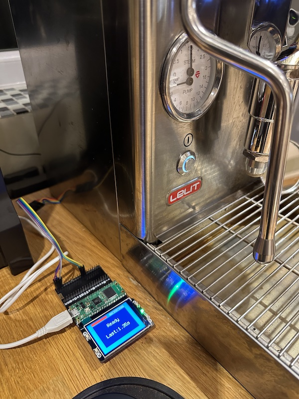
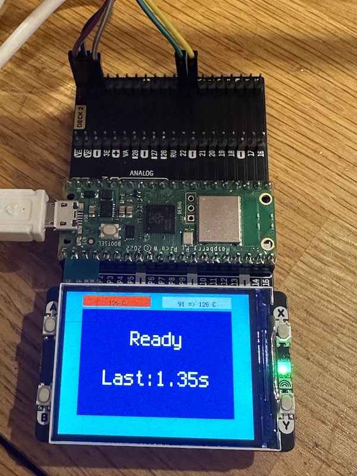
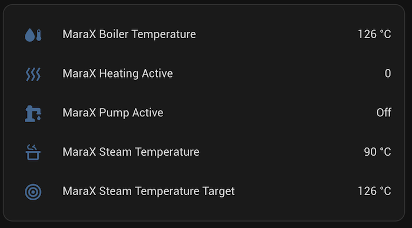
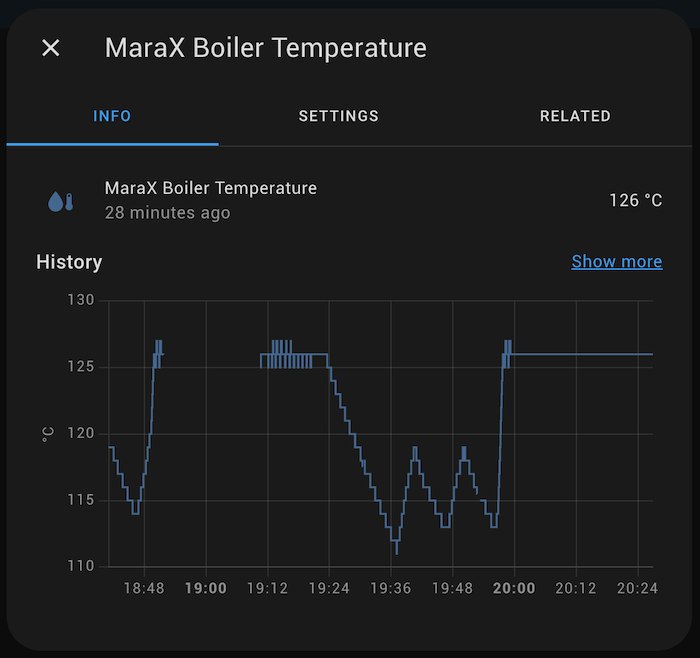
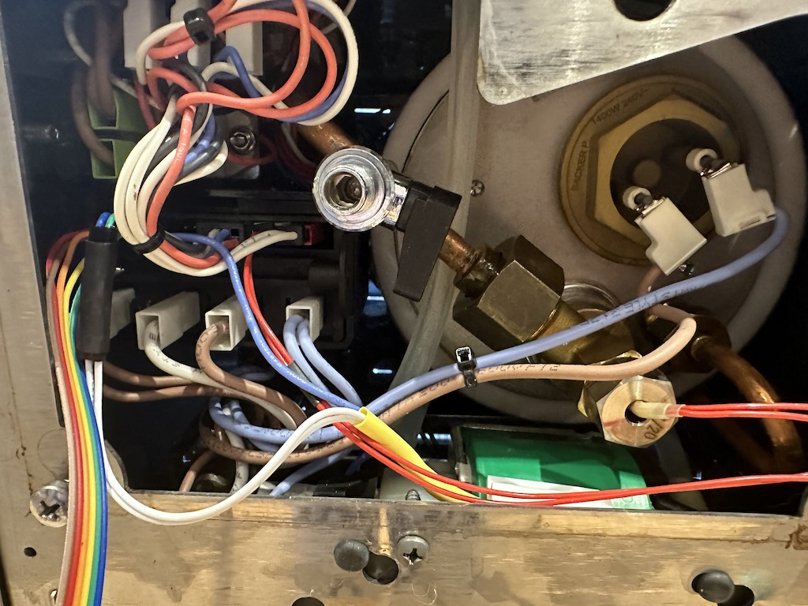
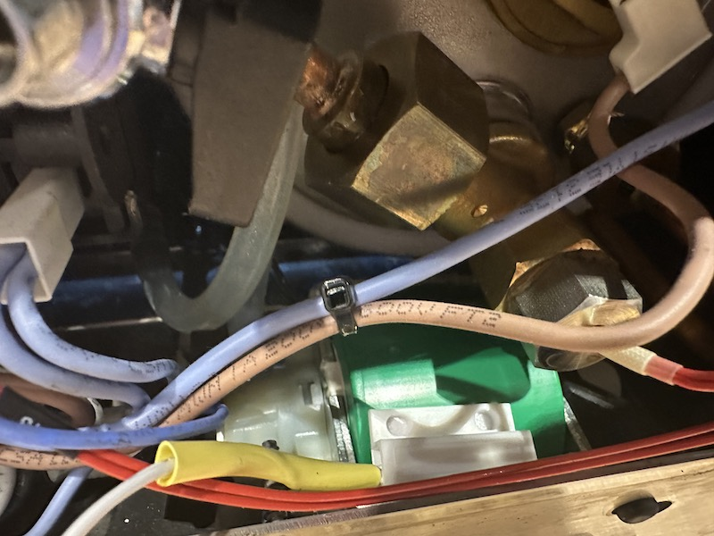
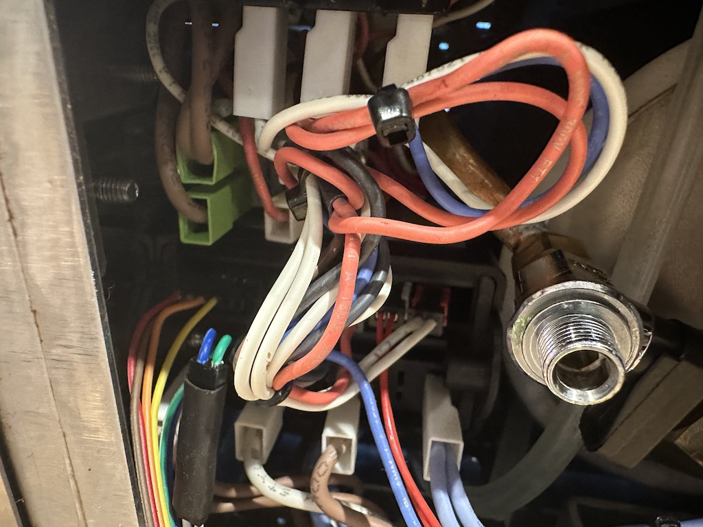
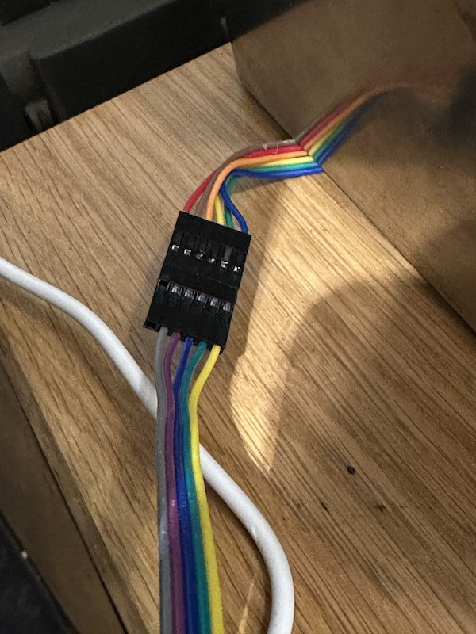

# MaraX-Pico

Monitor MaraX data from MQTT, with a Raspberry Pico W and CircuitPython





## Requirements

### Hardware

- [Raspberry Pico W](https://shop.pimoroni.com/products/raspberry-pi-pico-w)
- [Pico Display Pack 2.0](https://shop.pimoroni.com/products/pico-display-pack-2-0)
- [Pico Omnibus](https://shop.pimoroni.com/products/pico-omnibus) or some kind of breadboard or creative soldering to connect 5 wires
- `MC-38` reed switch
- [Lelit Mara X](https://lelit.com/product/marax-pl62x/) coffee machine

### Software
- [CircuitPython](https://circuitpython.org/board/raspberry_pi_pico_w/) and [Adafruit libraries](https://github.com/adafruit/circuitpython)
- Running WiFi, MQTT server, Home Assistant (optional)

## Configuration

- Copy `adafruit_bitmap_font`, `adafruit_display_text`, `adafruit_minimqtt` and `adafruit_st7789.mpy` to `lib/`
- Copy `env.example` as `.env` to the Pico and edit it, filling out WiFi and MQTT details
- Copy `code.py` to the Pico

## Connections

- Connect RX, TX and GND from the 6-pin debug interface under the Mara X to Pico pins 1, 2 and 3 (`GP0`, `GP1` and `GND`). Then swap pins 1 and 2, because it never works on the first try. Refer to Similar Projects section for detailed pictures on where to connect on the Mara X

- Stick the MC-38 reed switch (white in the pictures) to the side of the pump (green for me, your colour may vary)

- Connect two wires from the MC-38 reed switch to Pico pin 12 and 13 (`GP9` and `GND`)

- If using Pico Omnibus, take special care to where the pins are, as the decks are mirrored (a pin on the left side of the Pico would be on the right side connector on the Omnibus)

- Power the Pico preferably from USB or separate 5v supply. Pin 1 on the Mara X supposedly has 12v (you'd need a step down regulator) but it wasn't reliable for me or maybe my connector has slightly popped off.

## Home Assistant

Edit `configuration.yaml` and add these to Home Assistant:

```yaml
mqtt:
  sensor:
    - state_topic: "marax/pump/status"
      name: MaraX Pump Active
      unique_id: marax.pump
      icon: mdi:water-pump
    - state_topic: "marax/uart/data"
      name: MaraX Boiler Temperature
      unique_id: marax.boiler.temp
      value_template: "{{ value_json.boiler_temp }}"
      unit_of_measurement: "°C"
      icon: mdi:water-thermometer
    - state_topic: "marax/uart/data"
      name: MaraX Steam Temperature
      unique_id: marax.steam.temp
      value_template: "{{ value_json.steam_temp }}"
      unit_of_measurement: "°C"
      icon: mdi:pot-steam-outline
    - state_topic: "marax/uart/data"
      name: MaraX Temperature Target
      unique_id: marax.temp.target
      value_template: "{{ value_json.temp_target }}"
      unit_of_measurement: "°C"
      icon: mdi:bullseye
    - state_topic: "marax/uart/data"
      name: MaraX Counter
      unique_id: marax.counter
      value_template: "{{ value_json.counter }}"
      icon: mdi:bullseye
    - state_topic: "marax/uart/data"
      name: MaraX Heating Active
      unique_id: marax.heating
      value_template: "{{ value_json.heating }}"
      icon: mdi:heat-wave
```




## Close Up Pictures



Overview. 4 wires on the debug connector, 2 wires connected to the white wires from the reed switch.



Detailed shot of the reed switch on the Pump (green)



Debug connector, 4 wires going in, and 2 wires from reed switch



Ribbon cable coming out from the MaraX and gets connected to board.

## Similar Projects

- [Lelit MaraX - Data Visualisation 'Mod'](https://www.home-barista.com/espresso-machines/lelit-marax-data-visualisation-mod-t66187.html)
- [Pimp My Mara-X](https://github.com/michelhe/pimp-my-marax)
- [marax_monitor](https://github.com/bancbanus/marax_monitor)
- [MaraX_Visualizer](https://gitlab.com/jousis/marax_visualizer)
- [Mara X Meter](https://github.com/Jerey/mara-x-meter)
